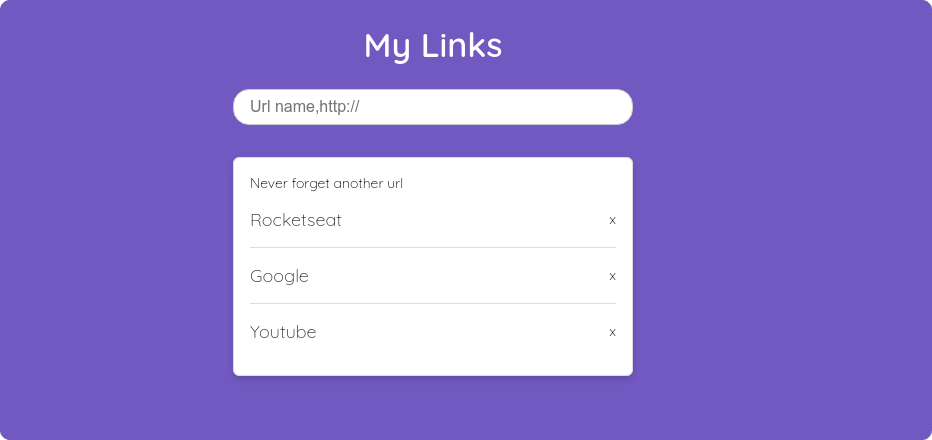

<p align="center">
  
</p>

## Build server and API with Node.js
The application was made using the teaching of the video [Node.js: Iniciando da teoria à prática | Masterclass #11](https://www.youtube.com/watch?v=DiXbJL3iWVs). The largest one was built using native Node.js modules.

* [fs](https://nodejs.org/api/fs.html)
* [path](https://nodejs.org/api/path.html)
* [http](https://nodejs.org/api/http.html)
* [url](https://nodejs.org/api/url.html)
### About Application
The application is about the user typing the name and url that will be saved in API. So that he can click, and consequently directed to the url page.

## Chanllenges

- [ ] Implement REST API.
- [ ] Make API works/operate with ID.
- [ ] Usage custom attributes to save/get name and url data.

## Run application
Install the dependencies
```
npm install
```

Run server:
```
npm start
```

Run API:
```
npm run api
```

## License

[MIT License](./LICENSE)